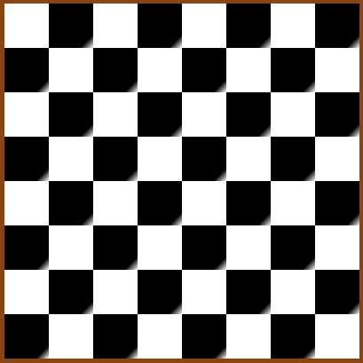

# Gradiente

````
Tile.prototype.desenhar = function(){
  var ctx = this.context;
  ctx.save();
  var grd = ctx.createLinearGradient(this.x, this.y,
     this.x + this.tamanho, this.y + this.tamanho);
  grd.addColorStop(0,this.cor);
  grd.addColorStop(0.85,this.cor);
  grd.addColorStop(1, COR_BRANCA);
  ctx.beginPath();
  ctx.fillStyle = grd;
  ctx.fillRect(this.x,this.y,this.tamanho,this.tamanho);
  ctx.restore();
};
````


